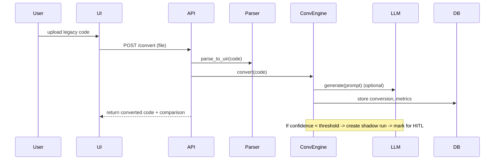
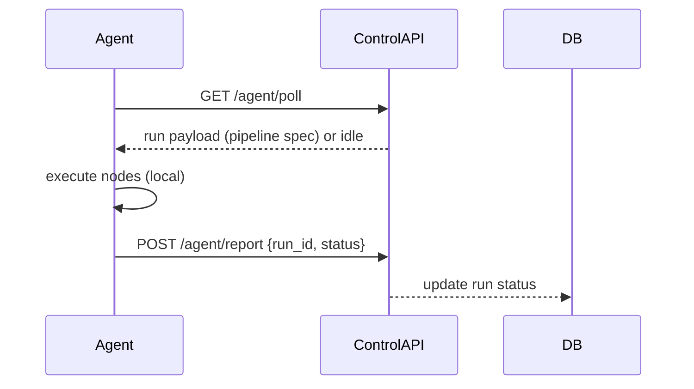

# Nexora Architecture Diagrams

High-level architecture and sequence flows for the Nexora MVP.

## System Overview (graph)

```mermaid
graph LR
  subgraph ControlPlane[Control Plane]
    UI[Next.js Frontend]
    API[FastAPI Backend]
    DB[(Metadata DB / SQLite)]
    LLM[LLM Adapter (Mock / OpenAI)]
    CI[CI / GitHub Actions]
  end

  subgraph DataPlane[Data Plane (Customer)]
    Agent[Data-plane Agent]
    DataSources[(Customer Data)]
  end

  UI -->|API calls (/api/*)| API
  API -->|persist metadata| DB
  API -->|call| LLM
  API -->|queue remote runs| Agent
  Agent -->|execute pipelines against| DataSources
  Agent -->|report results| API
  CI -->|build/publish| API
  CI -->|build/publish| UI
```

## Conversion Sequence (sequence)



## Agent Polling Flow (graph)



---

See also: `docs/Part1_Architecture.md`, `docs/Part2_IR_Conversion.md`, and `docs/Part9_Shadow_HITL_API_DB.md` for more detail.
