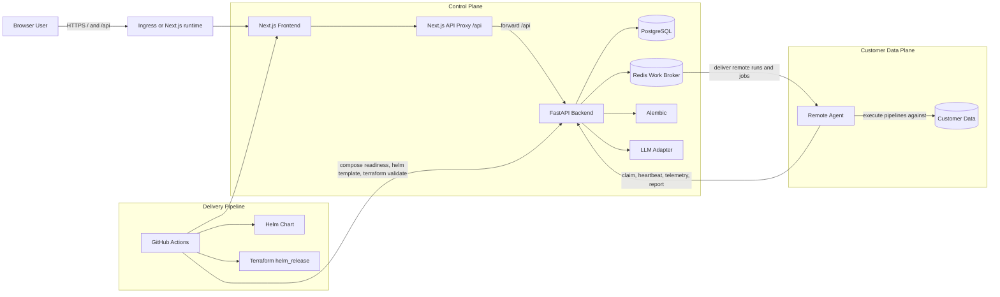
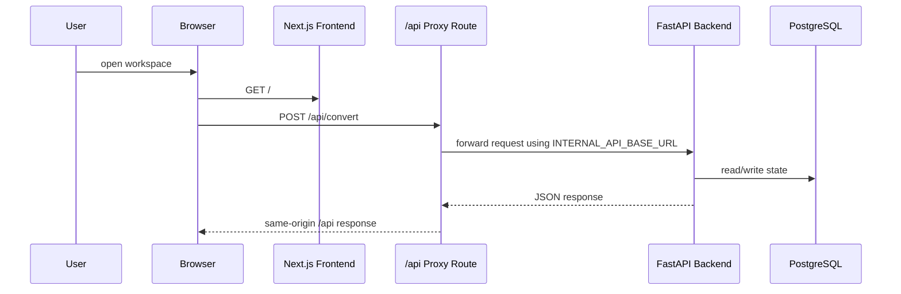
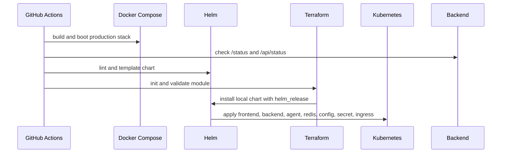
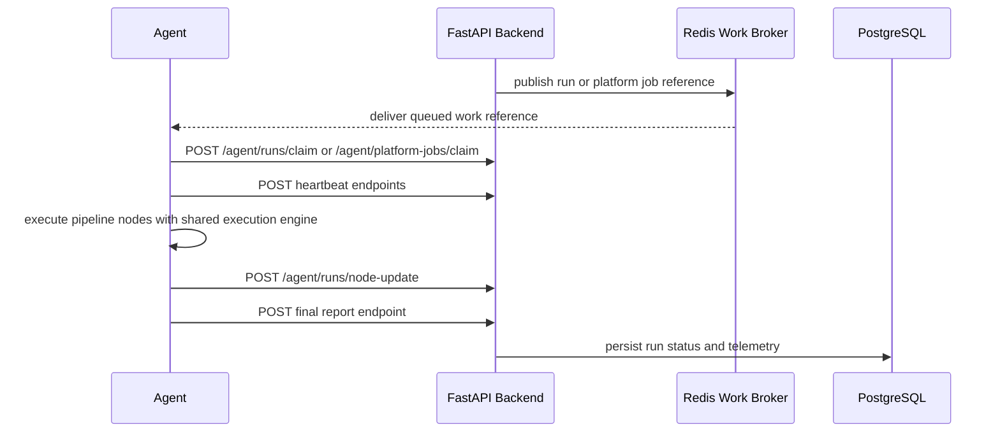

# Nexora Architecture Diagrams

High-level architecture and sequence flows for the current Nexora runtime model.

## System overview

## Browser request path

## Deployment sequence

## Remote agent flow

---

See also: `ARCHITECTURE.md`, `docs/infra/HELM_TERRAFORM.md`, and `docs/Part10_Deployment_CICD.md`.
